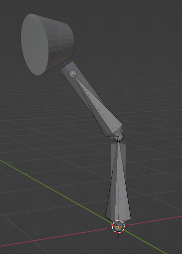




**Rig a simple 2-bones table lamp**
- create bone
- extrude 2nd bone
- edit bones position to match geometry
- rename bones
- constrain "child of" the geometry to the bones (set inverse)
- pose the bones to bend the lamp


