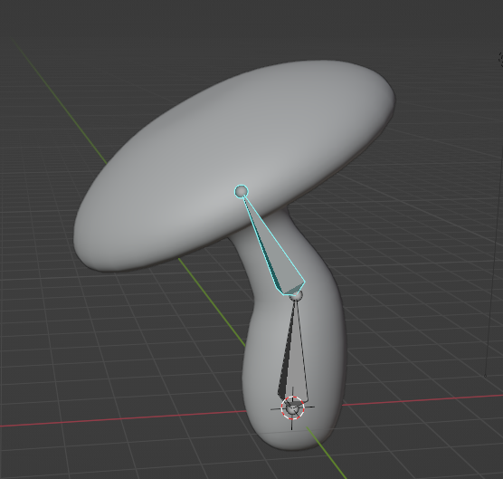




**Rig a simple 2-bones mushroom**
- create bone
- extrude 2nd bone
- edit bones position to match geometry
- rename bones
- constrain "armature" the geometry to the bones
- pose the bones to bend the mushroom


